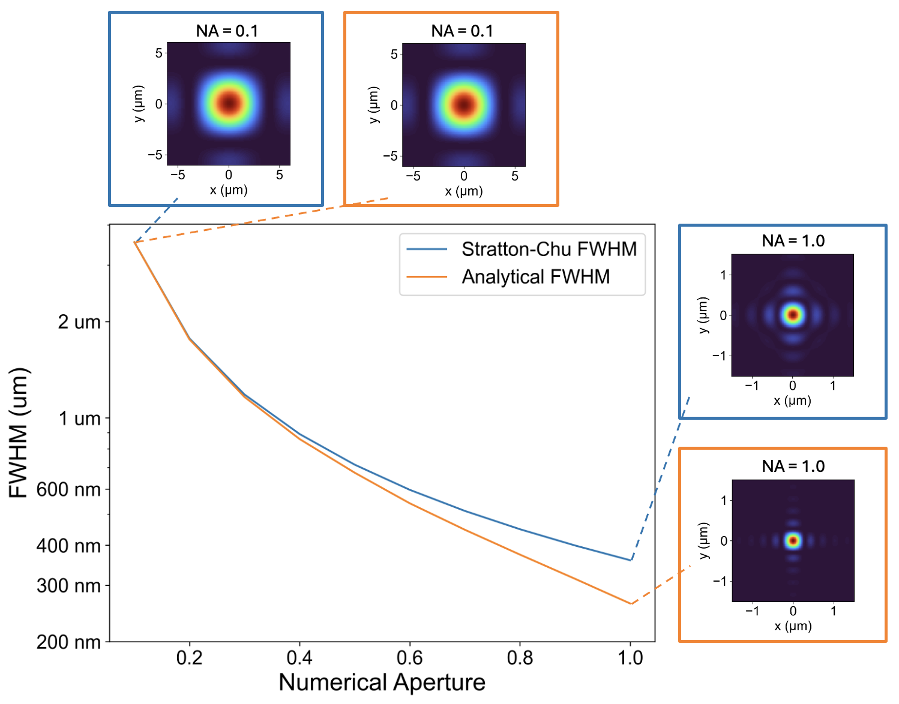

# Vectorial_Diffractive_PSF

This repo implements nearfield to farfield transformation using the **Stratton-Chu formula**. The main purpose of the repo is to serve as an easy to use tool for calculating accurate ideal point-spread-functions (PSFs) for high numerical aperture (NA) lens with apertures beyond circular shapes (e.g. rectangular).

When designing a refractive or diffractive lens (e.g. with metasurfaces), people use the [Airy disk](https://en.wikipedia.org/wiki/Airy_disk) as the ideal focus, which they can compute the full width at half maximum (FWHM) or strehl ratios. However, Airy disk is based on scalar diffraction theory ([Fraunhofer diffraction](https://en.wikipedia.org/wiki/Fraunhofer_diffraction_equation)), and it breaks down for high NA cases, e.g. NA  > 0.8 in air, or NA > 1.0 in immersion oil (however many papers on high NA lens design still use Airy disk).

Vectorial diffraction is thus required, and common methods include Debye-Wolf Integral and Stratton-Chu Formula. While there are [papers on this topic](https://opg.optica.org/directpdfaccess/80aa040f-adee-47f0-a5a8fba57d982be8_383248/josaa-35-4-526.pdf?da=1&id=383248&seq=0&mobile=no), it would be nice to have an easy-to-use tool for this calculation, hence the purpose of this repo. 

The code takes an ideal vectorial near field, for example a linearly polarized field with a phase profile of a focusing lens, or right-handed circularly polarized light as in geometric phase metalens), and runs the Stratton-Chu formula to compute the ideal focus profile in the farfield.

## comparison with analytical expression:


## Example usage
```python
python main.py configs/square_geometric_phase_lens.yml
```
